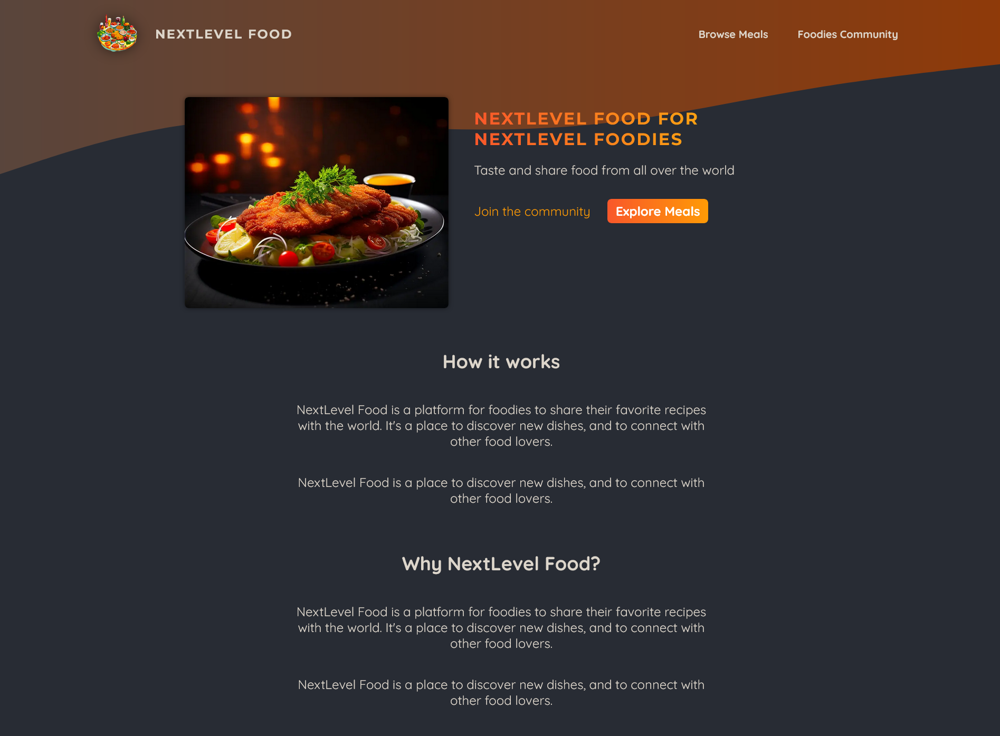
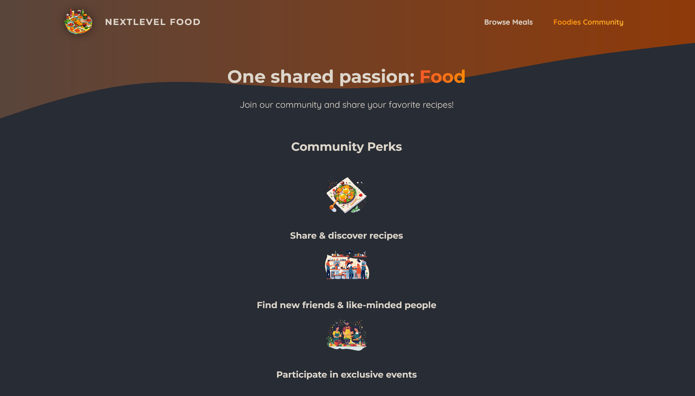
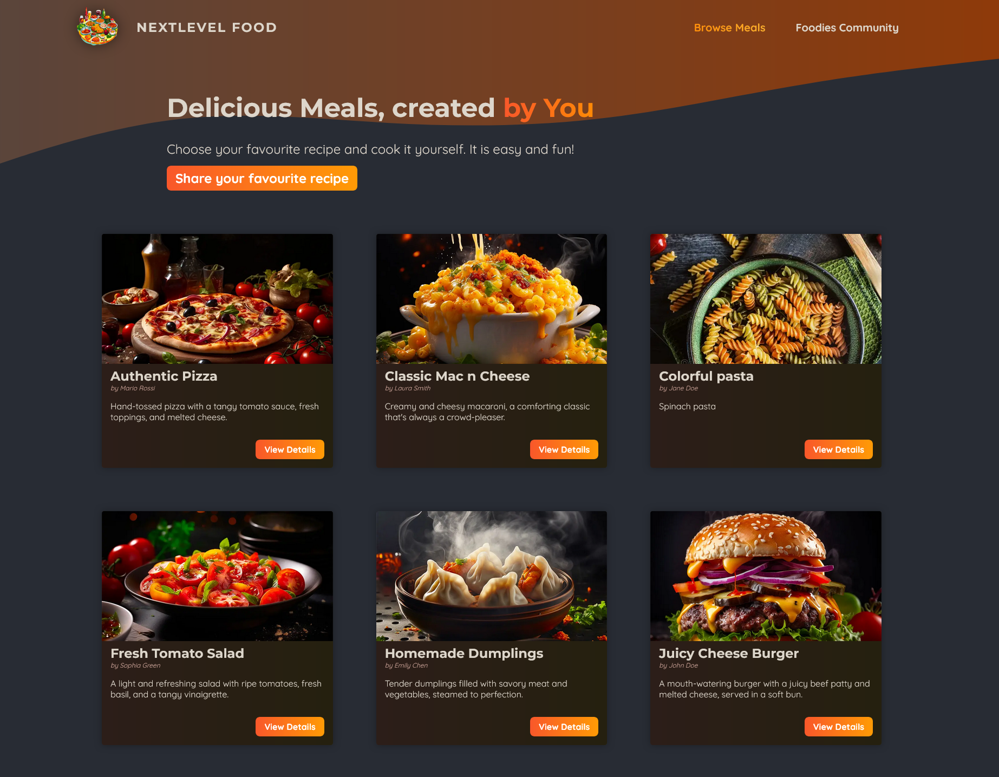
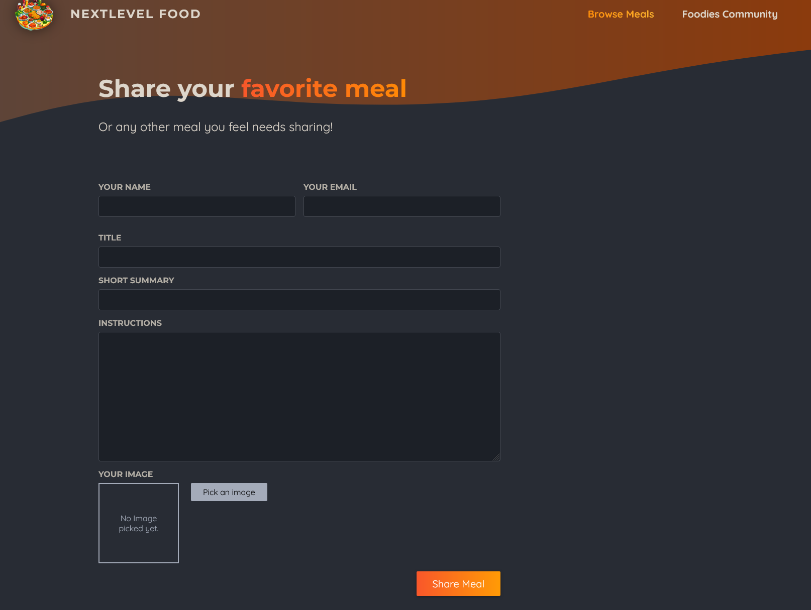

## Introduction

Foodies app where you can share a meal with the world.

This is a [Next.js](https://nextjs.org/) project bootstrapped with [`create-next-app`](https://github.com/vercel/next.js/tree/canary/packages/create-next-app).

## Getting Started

First, run the development server:

```bash
npm run dev
# or
yarn dev
# or
pnpm dev
# or
bun dev
```
Open [http://localhost:3000](http://localhost:3000) with your browser to see the result.

You can start editing the page by modifying `app/page.tsx`. The page auto-updates as you edit the file.

This project uses [`next/font`](https://nextjs.org/docs/basic-features/font-optimization) to automatically optimize and load Inter, a custom Google Font.

## Deploy you web app to Vercel and Create a Postgres database

https://nextjs.org/learn/dashboard-app/setting-up-your-database 
Mine: https://nextjs-foodies-app.vercel.app/

The script for creating and running the DB is in scripts/seed.js. Run it with

`npm run seed`

## Learn More

To learn more about Next.js, take a look at the following resources:

- [Next.js Documentation](https://nextjs.org/docs) - learn about Next.js features and API.
- [Learn Next.js](https://nextjs.org/learn) - an interactive Next.js tutorial.

You can check out [the Next.js GitHub repository](https://github.com/vercel/next.js/) - your feedback and contributions are welcome!

## Deploy on Vercel

The easiest way to deploy your Next.js app is to use the [Vercel Platform](https://vercel.com/new?utm_medium=default-template&filter=next.js&utm_source=create-next-app&utm_campaign=create-next-app-readme) from the creators of Next.js.

Check out our [Next.js deployment documentation](https://nextjs.org/docs/deployment) for more details.


### Setup

Delete a record from DB
DELETE FROM meals WHERE title='test1';


## Build the app for production

With running this command we can deploy the app on a server

`npm run build`

Then start the production server with command:

`npm start`

Nextjs uses heavy caching, so it is faster with using pre-generated pages. 
For this use method revalidatePath(), for example revalidatePath("/meals", "layout") 
to tell Nextjs to revalidate the cache
That means that it will validate again the page that is passed as an argument.
## Preview app image

Home page 



Foodies Community



Browse meals



Share meal
